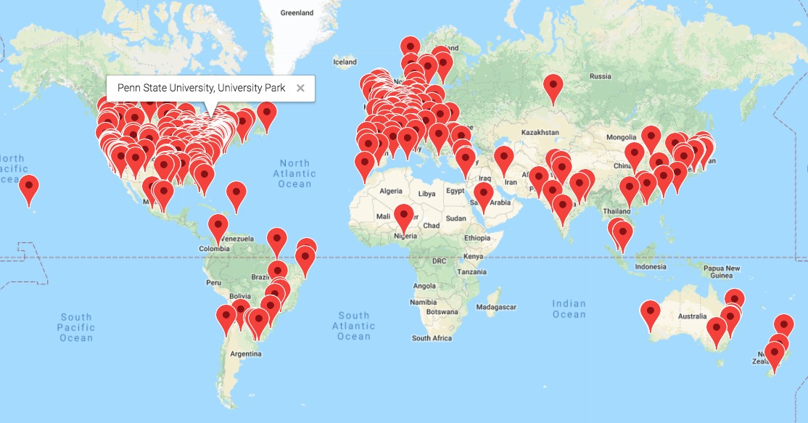
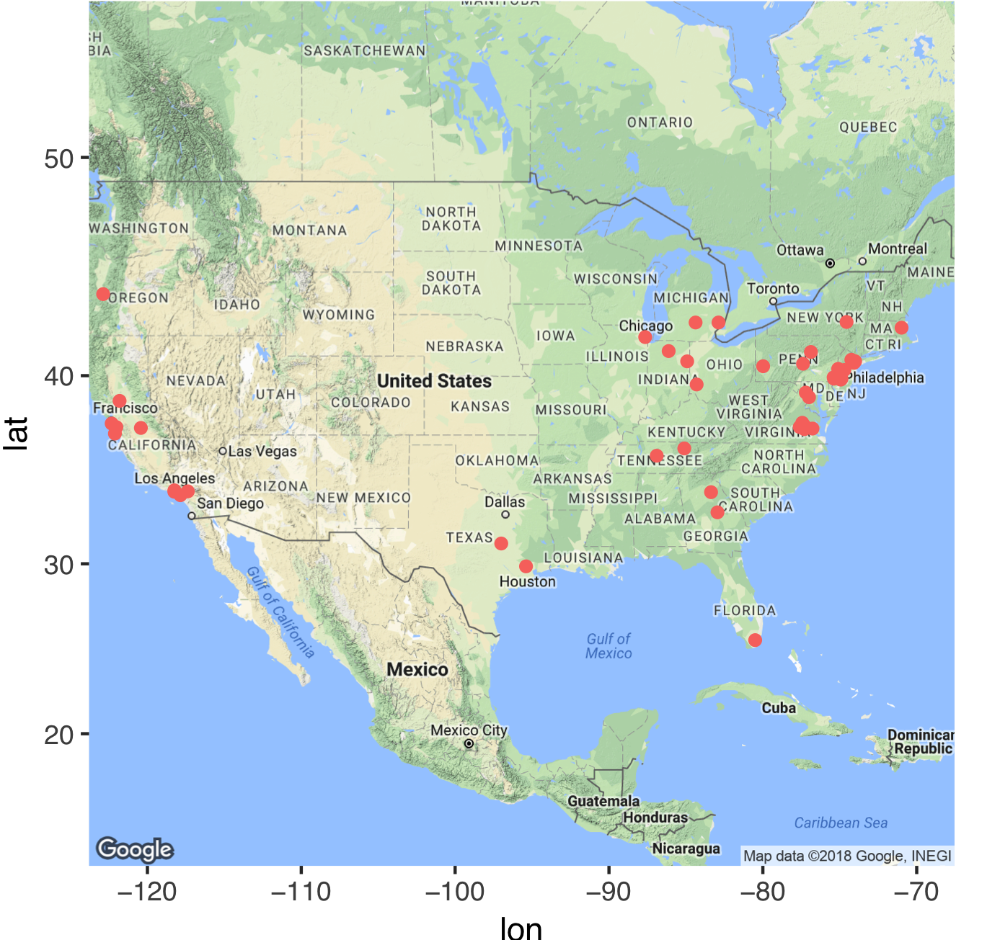
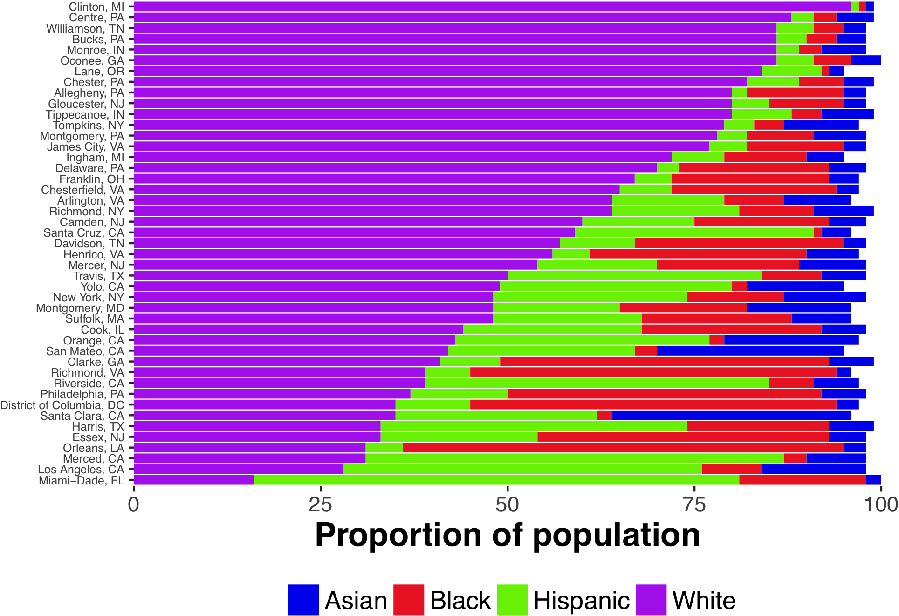
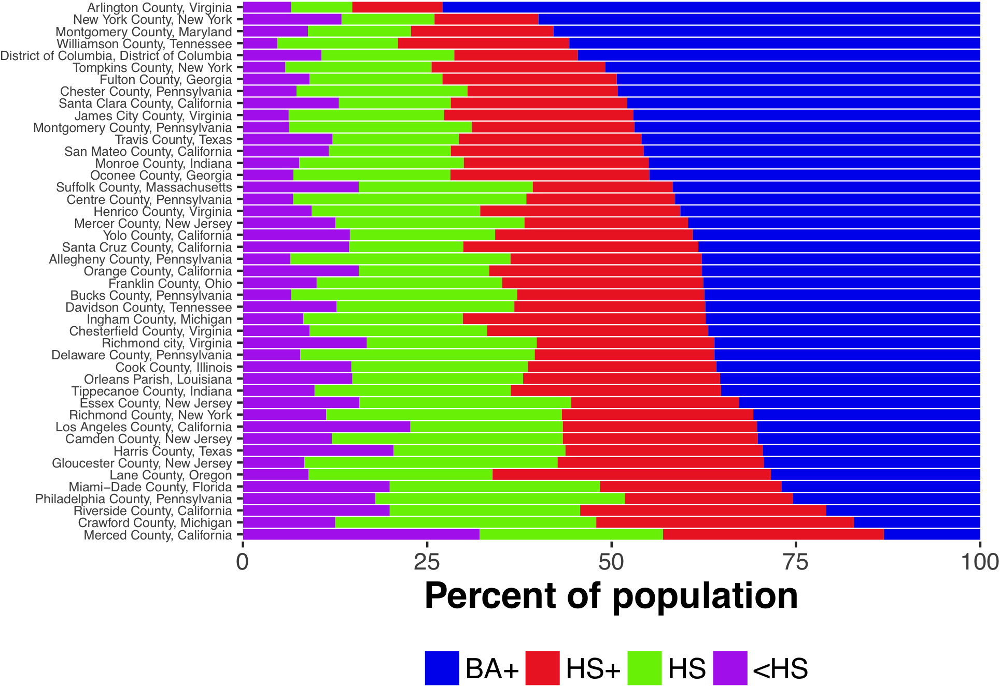
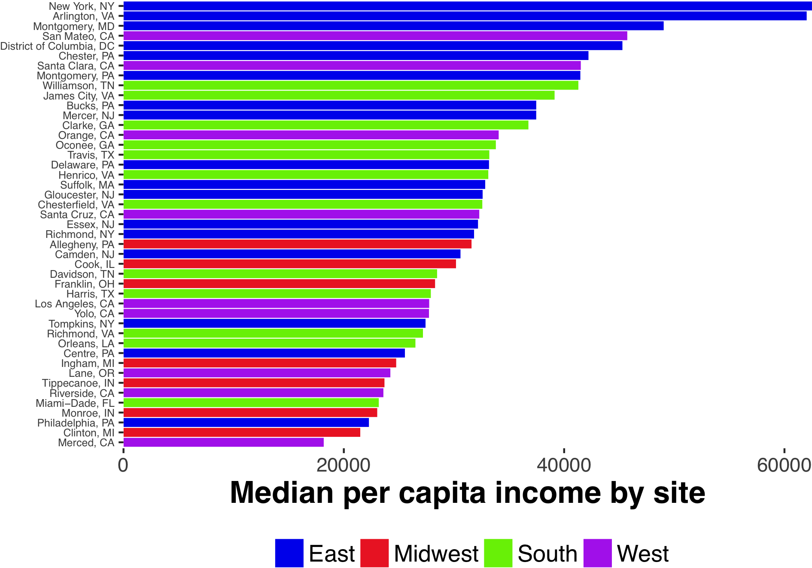
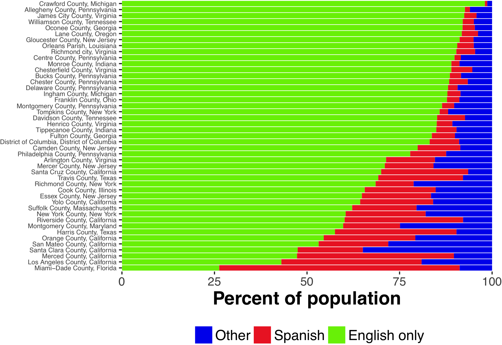
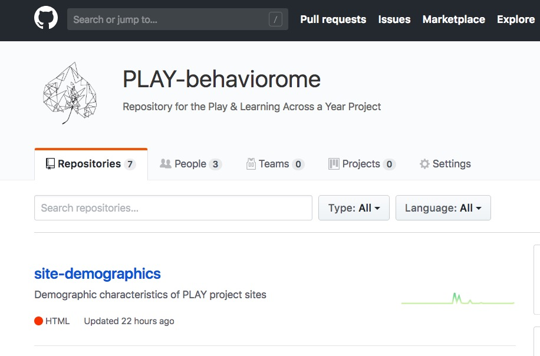

```{r setup, include=FALSE}
knitr::opts_chunk$set(echo = FALSE, fig.width = 8.5)
```

## Acknowledgements

<div class="centered">


</br>


</div>

---

### Karen Adolph (NYU)
### Catherine Tamis-LeMonda (NYU)
### Kasey Soska (Databrary/PLAY)
### Jeff Spies (Databrary, 221b.io)

## Agenda

- Is there a reproducibility 'crisis' in science?
- Video as data and documentation
- From micro- to macro-scale
- The future of open social & behavioral science

# Reproducibility

## Is there a reproducibility crisis?

- Yes, a significant crisis
- Yes, a slight crisis
- No crisis
- Don't know

---

<div class="centered">
<a href="http://www.nature.com/polopoly_fs/7.36716.1469695923!/image/reproducibility-graphic-online1.jpeg_gen/derivatives/landscape_630/reproducibility-graphic-online1.jpeg" height=450px>

</a>

[Baker 2016](http://doi.org/10.1038/533452a)
</div>

<style>
slides > slide { overflow: scroll; }
slides > slide:not(.nobackground):before {
  background: none;
  }
slides > slide:not(.nobackground):after {
  content: '';
  background: none;
  }
}
</style>

## Not just behavioral science...

<div class="centered">
<a href="http://www.nature.com/polopoly_fs/7.36718.1464174471!/image/reproducibility-graphic-online3.jpg_gen/derivatives/landscape_630/reproducibility-graphic-online3.jpg">

</a>

---

<div class="centered">

</div>

## Why is reproducibility hard? {.smaller}

<div class="centered">
<a href="http://www.nature.com/polopoly_fs/7.36719.1464174488!/image/reproducibility-graphic-online4.jpg_gen/derivatives/landscape_630/reproducibility-graphic-online4.jpg">

</a>

[Baker 2016](http://doi.org/10.1038/533452a)
</div>

## A manifesto for reproducible science {.smaller}

<div class="centered">
<a href="http://www.nature.com/articles/s41562-016-0021/figures/1">

</a>

[Munafo et al. 2017]](http://doi.org/10.1038/s41562-016-0021)
</div>

## Improving reproducibility

- Open data
- Open materials
- Better, more widely shared procedural documentation
- Data interoperability and linkage

# Video as data and documentation

---

<div class="centered">
<video controls>
  <source src="https://nyu.databrary.org/slot/27087/0,372193/asset/119877/download?inline=truesplash.mp4#t=2,37" type="video/mp4">
  Your browser does not support the video tag.
</video>

Adolph, K., Tamis-LeMonda, C. & Gilmore, R.O. (2017). PLAY Project: Pilot Data Collections. Databrary. Retrieved August 21, 2018 from https://nyu.databrary.org/volume/444
</div>

## Video...

- Captures spatial & temporal structure of behavior
- Huge potential for secondary use

## Video as documentation... {.smaller}

<div class="centered">
<video width="800" controls>
  <source src="https://nyu.databrary.org/slot/14765/0,79273/asset/64898/download?inline=true" type="video/mp4">
Your browser does not support the video tag.
</video>

The PLAY Project Wiki: <https://dev1.ed-projects.nyu.edu/wikis/docuwiki/doku.php/landing>
</div>

## Video's challenges

- Faces & voices, names
- Blurring, alteration diminishes value for secondary use
- Hard(er) to share
- Diversity of formats

## Meeting the challenges

- Convert to consistent file formats
- Restrict access
- Institutional agreement
- Secure permission to share

---

<div class="centered">

</div>

---

<div class="centered">

</div>

---

<div class="centered">
<video width="800" loop data-autoplay>
  <source src="mov/databrary-splash.mp4" type="video/mp4">
Your browser does not support the video tag.
</video>
</div>

# Big data behavioral science: From micro- to macro-scale

## Play & Learning Across a Year (PLAY) {.smaller}

<div class="centered">
<video controls>
  <source src="https://nyu.databrary.org/slot/27087/0,372193/asset/119877/download?inline=truesplash.mp4#t=37,80" type="video/mp4">
  Your browser does not support the video tag.
</video>

Adolph, K., Tamis-LeMonda, C. & Gilmore, R.O. (2017). PLAY Project: Pilot Data Collections. Databrary. Retrieved August 21, 2018 from https://nyu.databrary.org/volume/444
</div>

## Multiple functional domains

- Language & gesture
- Locomotion & physical activity
- Object interaction
- Emotional expression

---

<div class="centered">

</div>

## Parent-reported...

- Demographic & health information
- Child vocabulary
- Media use
- Temperament

## Sampling

- $n=900$ dyads: 300 12-mo-olds, 300 18 mo-olds, 300 24 mo-olds
- First-borns
- Approximating demographics of $n=30$ data collection sites

---

<div class="centered">

</div>

---

<div class="centered">

</div>

---

<div class="centered">

</div>

---

<div class="centered">

</div>

---

<div class="centered">

</div>

## Shared on Databrary

- Permission to share with researchers
- With geographic codes (Census Block Group)

## Reproducible workflows

<div class="centered">
<video controls width=600px>
  <source src="https://nyu.databrary.org/slot/14765/0,79273/asset/64898/download?inline=true" type="video/mp4">
  Your browser does not support the video tag.
</video>

Video-enhanced wiki: <https://dev1.ed-projects.nyu.edu/wikis/docuwiki/doku.php>
</div>

---

- R + R Markdown, `acs`, `choroplethr` packages

<div class="centered">

</div>

# The future of open social & behavioral science

## Improving reproducibility

- Open data & materials
- Better, more widely shared procedural documentation

## Spanning levels of analysis

- Planning for linkage (e.g., geographic)
- Blurring disciplinary boundaries
- Seeking partnerships
    - What would *your* colleagues want to know about the microstructure of infant/mother behavior?

## Accelerating discovery

- FAIR (**F**indable, **A**ccesible, **I**nteroperable, and **R**eusable) data [(Wilkinson et al., 2016)](http://dx.doi.org/10.1038/sdata.2016.18)
- Federal data sources with (where possible) APIs 
- Data repositories

## Maintaining participant privacy

- Ask permission to share (especially for sensitive, identifiable data)
    - Use template language
    - [(Gilmore & Nilsonne, 2017)](https://osf.io/9d5hr/)
- Don't promise to destroy data (but GDPR?)
- Don't unduly restrict future reuses

---

<div class="centered">

</div>

<div class="notes">
To make the future of big data behavioral science one where we're not just blind men studying our small part of the elephant.
</div>

---

<div class="centered">

</div>

---

<div class="centered">

<video width="600" loop data-autoplay>
  <source src="mov/databrary-splash.mp4" type="video/mp4">
</video>

rogilmore@psu.edu

<https://gilmore-lab.github.io>

<https://github.com/gilmore-lab/2018-09-07-fsrdc/>
</div>

# Materials

---

This talk was produced on `r Sys.time()` in [RStudio 1.1.453](http://rstudio.com) using R Markdown.
The code and materials used to generate the slides may be found at <https://github.com/gilmore-lab/2018-09-07-fprs/>. 
Information about the R Session that produced the slides is as follows:

---

```{r session-info}
sessionInfo()
```

